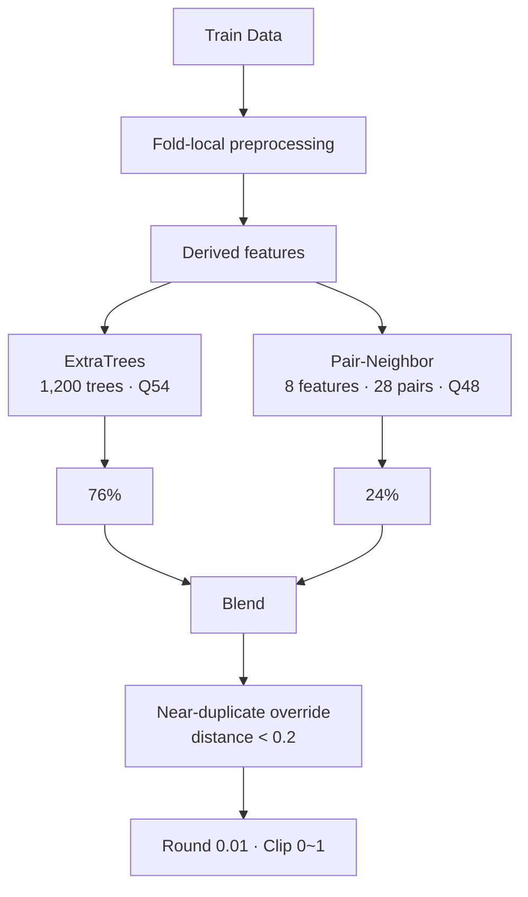

<div align="center">

# 🧠 Stress Score Prediction — BS

### ExtraTrees + Pair-Neighbor 최종 모델 연구

<p>
  
  
  
</p>

**Scope:** BS 8/6 최종 채택 모델 · ExtraTrees/Pair-Neighbor 계보

</div>

## 최종 결과

| 항목 | 결과 |
|---|---:|
| 최종 모델 | **BS 8/6 — ExtraTrees + Pair-Neighbor** |
| 내부 검증 MAE | **0.147300** |
| Public MAE | **0.1266866667** |
| Private MAE | **0.1473** |
| 블렌드 | **ExtraTrees 76% + Pair-Neighbor 24%** |

**Canonical Notebook**  
[`8_6/stress_prediction_combined_final_0806_1.ipynb`](8_6/stress_prediction_combined_final_0806_1.ipynb)

**Canonical submission setting:** `submit_combined_final_0806_0.24.csv` 생성 설정  
**Post-final records:** `retuned` · `final_rule_compliant`

### Score context

- V1 initial baseline anchor: Public MAE `0.1282776667 → 0.1266866667` (Δ `-0.0015910`, 약 **1.24% 상대 감소**)
- Team V7 lineage milestone: `0.1272333333 → 0.1266866667` (Δ `-0.0005467`, 약 **0.43% 상대 감소**)
- V14 historical public reference: `0.1278085845 → 0.1266866667`은 약 **0.88% 상대 감소**지만 canonical baseline으로 간주하지 않음

기준 없는 단일 퍼센트 향상 표현 대신 원 점수와 비교 대상을 함께 기록합니다.  
→ [UNIFIED evaluation notes](https://github.com/thisisstress/stress_project_UNIFIED/blob/main/docs/EVALUATION_NOTES.md)

## 모델 구조



### 핵심 설정

| 구성 | 설정 |
|---|---|
| ExtraTrees | `n_estimators=1200`, `max_features=1`, `random_state=42` |
| Tree aggregation | 54% 분위수 |
| Pair aggregation | 48% 분위수 |
| Blend | Tree `0.76` + Pair `0.24` |
| Tree 입력 | `gender` 제외 |
| Winsorization | `mean_working`, 이완기 혈압, 콜레스테롤, 혈당 |
| Winsorization 기준 | 각 Fold의 Train partition |
| 근접중복 보정 | 표준화 거리 `< 0.2` → 최근접 Train 타깃 |
| 최종 출력 | 0.01 반올림 · `[0, 1]` clip |

## 주요 아이디어

### 파생변수

BMI · 맥압 · 평균동맥압 · 혈압 비율 · 콜레스테롤/혈당 비율 · 행별 결측치 수

### Weighted Quantile ExtraTrees

- 개별 Tree 예측 → 54% 분위수 집계
- `max_features=1`
- 중요 피처 복제 → 분할 후보 선택 확률 조정

### Pair-Neighbor

**입력 8개**

```text
mean_working
bmi
cholesterol
height
glucose
weight
cholesterol_glucose_ratio
bone_density
```

- Train 분포 기준 rank 변환
- 모든 2개 조합 → 28개 pair space
- 각 공간 최근접 Train target
- 28개 target의 48% 분위수
- ExtraTrees와 `76:24` 결합

## 주요 모델 비교

| 모델 | 내부 MAE | Public MAE | 결과 |
|---|---:|---:|---|
| V7 Pair-Neighbor | `0.146644` | `0.1272333333` | 팀 기준 모델 |
| V34 Tree·Pair Joint Tuning | `0.148033` | `0.1271866667` | 최종 통합 직전 후보 |
| **BS 8/6** | **`0.147300`** | **`0.1266866667`** | **최종 채택** |

**OOF 비교 주의:** split · seed · 전처리 계약이 다른 미세 MAE 차이의 직접 순위화 제외.

## 주요 Notebook

- [`8_6/stress_prediction_combined_final_0806_1.ipynb`](8_6/stress_prediction_combined_final_0806_1.ipynb) — 최종 채택 모델
- [`8_6/stress_prediction_final_candidates_0806.ipynb`](8_6/stress_prediction_final_candidates_0806.ipynb) — 8월 6일 후보 비교
- [`stress_prediction_co/stress_prediction_team_best_v7_verified.ipynb`](stress_prediction_co/stress_prediction_team_best_v7_verified.ipynb) — V7 재현
- [`stress_prediction_co/stress_prediction_best_verified.ipynb`](stress_prediction_co/stress_prediction_best_verified.ipynb) — 초기 Weighted Quantile ExtraTrees 기준점

## Related Repositories

| Repository | 범위 |
|---|---|
| [`stress_project_UNIFIED`](https://github.com/thisisstress/stress_project_UNIFIED) | 팀 최종 결과 · 모델 계보 |
| [`stress_project_JH`](https://github.com/thisisstress/stress_project_JH) | V7 Pair-Neighbor · 실행 코드 |
| `stress_project_SK` *(private)* | 대안 모델 · 후속 내부 R&D |

**Data boundary:** 원본 `train.csv` · `test.csv` · 정답 레이블 미포함. 공개 Notebook 원본 데이터 preview 제거. OOF 파일은 모델 예측값만 보존.

## License and attribution

**Public view · no public reuse license.**  
팀 제작 코드·문서·원본 도식은 All Rights Reserved. 별도 서면 허가 없는 재사용·수정·재배포 불가.

공동 저자와 역할: [AUTHORS.md](AUTHORS.md) · 권리 범위와 제3자 자료: [LICENSE](LICENSE) · [LICENSE_SCOPE.md](LICENSE_SCOPE.md)
