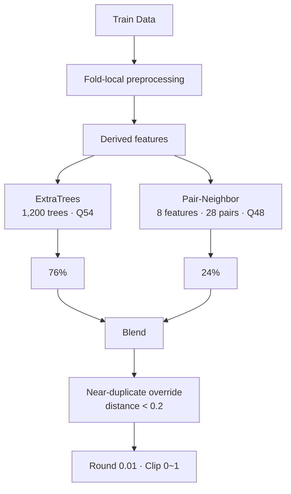

<div align="center">

# 🧠 Stress Score Prediction — BS

### ExtraTrees + Pair-Neighbor 최종 모델 연구

<p>
  
  
  
</p>

이 저장소에는 팀 최종 채택 모델인 **BS 8/6**과 그 전후의 ExtraTrees·Pair-Neighbor 실험이 보존되어 있습니다.

</div>

## 최종 결과

| 항목 | 결과 |
|---|---:|
| 최종 모델 | **BS 8/6 — ExtraTrees + Pair-Neighbor** |
| 내부 검증 MAE | **0.147300** |
| Public MAE | **0.1266866667** |
| Private MAE | **0.1473** |
| 블렌드 | **ExtraTrees 76% + Pair-Neighbor 24%** |

최종 실행 Notebook:

[`8_6/stress_prediction_combined_final_0806_1.ipynb`](8_6/stress_prediction_combined_final_0806_1.ipynb)

이 Notebook에서 `submit_combined_final_0806_0.24.csv`를 생성한 설정을 최종 모델로 봅니다. 이후 `retuned` 또는 `final_rule_compliant` 실험은 후속 기록입니다.

## 모델 구조



### 핵심 설정

| 구성 | 설정 |
|---|---|
| ExtraTrees | `n_estimators=1200`, `max_features=1`, `random_state=42` |
| Tree aggregation | 54% 분위수 |
| Pair aggregation | 48% 분위수 |
| Blend | Tree `0.76` + Pair `0.24` |
| Tree 입력 | `gender` 제외 |
| Winsorization | `mean_working`, 이완기 혈압, 콜레스테롤, 혈당 |
| Winsorization 기준 | 각 Fold의 Train partition |
| 근접중복 보정 | 표준화 거리 `< 0.2`일 때 최근접 Train 타깃 사용 |
| 최종 출력 | 소수 둘째 자리 반올림, `[0, 1]` 제한 |

## 주요 아이디어

### 파생변수

각 행의 값만 이용해 BMI, 맥압, 평균동맥압, 혈압 비율, 콜레스테롤·혈당 비율, 결측치 개수 등을 만들었습니다.

### Weighted Quantile ExtraTrees

ExtraTrees의 개별 트리 예측을 평균하지 않고 54% 분위수에서 집계했습니다. `max_features=1` 설정에서는 중요한 피처가 분할 후보로 더 자주 선택되도록 일부 피처를 복제하는 방식도 실험했습니다.

### Pair-Neighbor

다음 8개 피처를 Train 분포 기준 rank로 변환한 뒤 모든 2개 조합, 총 28개 공간에서 최근접 Train 샘플을 찾습니다.

```text
mean_working
bmi
cholesterol
height
glucose
weight
cholesterol_glucose_ratio
bone_density
```

28개의 최근접 타깃을 모아 48% 분위수로 집계하고 ExtraTrees 예측과 결합했습니다.

## 주요 모델 비교

| 모델 | 내부 MAE | Public MAE | 결과 |
|---|---:|---:|---|
| V7 Pair-Neighbor | `0.146644` | `0.1272333333` | 팀 기준 모델 |
| V34 Tree·Pair Joint Tuning | `0.148033` | `0.1271866667` | 최종 통합 직전 후보 |
| **BS 8/6** | **`0.147300`** | **`0.1266866667`** | **최종 채택** |

내부 MAE는 실험별 split과 seed가 다를 수 있어 작은 차이를 그대로 순위로 해석하지 않습니다.

## 주요 Notebook

- [`8_6/stress_prediction_combined_final_0806_1.ipynb`](8_6/stress_prediction_combined_final_0806_1.ipynb) — 최종 채택 모델
- [`8_6/stress_prediction_final_candidates_0806.ipynb`](8_6/stress_prediction_final_candidates_0806.ipynb) — 8월 6일 후보 비교
- [`stress_prediction_co/stress_prediction_team_best_v7_verified.ipynb`](stress_prediction_co/stress_prediction_team_best_v7_verified.ipynb) — V7 재현
- [`stress_prediction_co/stress_prediction_best_verified.ipynb`](stress_prediction_co/stress_prediction_best_verified.ipynb) — 초기 Weighted Quantile ExtraTrees 기준점

## Related Repositories

| Repository | 내용 |
|---|---|
| [`stress_project_UNIFIED`](https://github.com/thisisstress/stress_project_UNIFIED) | 팀 최종 결과와 모델 계보 |
| [`stress_project_JH`](https://github.com/thisisstress/stress_project_JH) | V7 Pair-Neighbor 연구와 실행 코드 |
| `stress_project_SK` | 대안 모델과 후속 R&D 기록 |

대회 원본 `train.csv`·`test.csv`와 정답 레이블은 저장소에 포함하지 않습니다. 공개 Notebook의 원본 데이터 미리보기 출력은 제거했으며, OOF 파일에는 모델 예측값만 보존합니다.

## License and attribution

팀이 작성한 소스 코드와 문서는 [MIT License](LICENSE)로 공개합니다. 공동 저자와 역할은 [AUTHORS.md](AUTHORS.md), 데이터·제3자 자료의 제외 범위는 [LICENSE_SCOPE.md](LICENSE_SCOPE.md)에서 확인할 수 있습니다.
