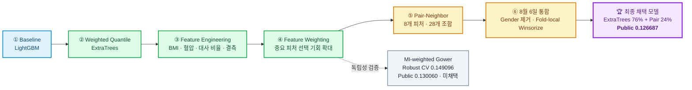
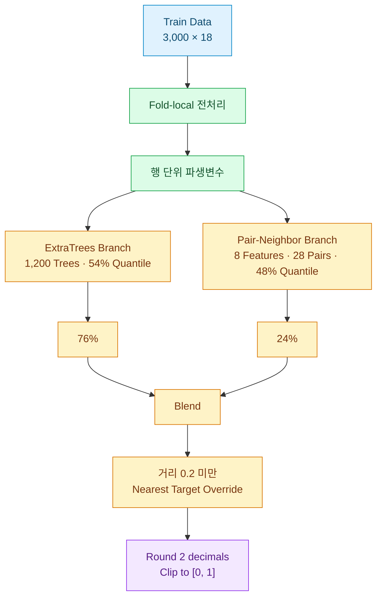

<div align="center">

# 🧠 Stress Score Prediction Lab

### 건강·생활 데이터를 활용한 스트레스 점수 회귀 연구

<p>
  
  
  
  
  
</p>

**Weighted Quantile ExtraTrees와 Pair-Neighbor를 결합해  
전역 패턴과 국소 유사 프로필을 함께 학습한 스트레스 점수 예측 프로젝트입니다.**

</div>

---

## 🧬 모델 계보



---

## 🏆 최종 결과

| 항목 | 결과 |
|---|---:|
| 최종 모델 | **ExtraTrees + Pair-Neighbor** |
| 내부 검증 MAE | **0.1473** |
| Public MAE | **0.1266866667** |
| Private MAE | **0.1473** |
| 최종 블렌드 | **ExtraTrees 76% + Pair-Neighbor 24%** |
| 평가 지표 | Mean Absolute Error — 낮을수록 우수 |

---

## ✨ 최종 모델 한눈에 보기



### 핵심 설정

| 구성 | 최종 설정 |
|---|---|
| ExtraTrees | `n_estimators=1200`, `max_features=1`, `random_state=42` |
| Tree aggregation | 트리 예측의 **54% 분위수** |
| Pair aggregation | 28개 최근접 타깃의 **48% 분위수** |
| Blend | Tree `0.76` + Pair `0.24` |
| Tree 입력 | `gender` 제거 |
| Winsorization | `mean_working`, 이완기 혈압, 콜레스테롤, 혈당 |
| Winsorization 기준 | 각 Fold의 Train partition에서만 계산 |
| Near-duplicate 보정 | 표준화 거리 `< 0.2`인 경우 최근접 Train 타깃으로 대체 |
| 최종 후처리 | 소수 둘째 자리 반올림 후 `[0, 1]` 범위 제한 |

---

## 🧩 모델링 전략

### 1. 누수 없는 행 단위 파생변수

각 행의 정보만 사용해 다음 변수를 생성했습니다.

| 파생변수 | 계산·의미 |
|---|---|
| `bmi` | 체중 / 신장² |
| `pulse_pressure` | 수축기 혈압 − 이완기 혈압 |
| `mean_arterial_pressure` | `(SBP + 2 × DBP) / 3` |
| `blood_pressure_ratio` | 수축기 혈압 / 이완기 혈압 |
| `cholesterol_glucose_ratio` | 콜레스테롤 / 혈당 |
| `missing_count` | 행별 결측 개수 |

다른 행이나 Test 전체의 통계를 사용하지 않아, 파생변수 생성 단계에서 데이터 누수를 피했습니다.

### 2. 중요 피처 가중

`max_features=1`인 ExtraTrees에서 중요 변수가 분할 후보로 더 자주 선택되도록 일부 피처를 복제했습니다.

대표 피처:

- `mean_working`
- `bmi`
- `cholesterol`
- `height`
- `glucose`
- `weight`
- `cholesterol_glucose_ratio`
- `bone_density`

복제 횟수는 실험 코드별로 다를 수 있으므로 README에서는 특정 횟수를 고정하지 않습니다.

### 3. Weighted Quantile ExtraTrees

1,200개의 ExtraTree가 만든 예측을 단순 평균하지 않고 정렬한 뒤 **54% 지점**을 선택합니다.

```text
tree_prediction
    = quantile(all_tree_predictions, 0.54)
```

MAE는 중앙값 계열의 예측과 잘 맞기 때문에, 평균보다 분위수 집계가 더 유리한지 실험으로 확인했습니다.

### 4. Rank-based Pair-Neighbor

다음 8개 피처를 Train 분포 기준 empirical rank로 변환합니다.

```text
mean_working
bmi
cholesterol
height
glucose
weight
cholesterol_glucose_ratio
bone_density
```

8개 피처의 모든 2개 조합, 총 28개 공간에서 가장 가까운 Train 샘플을 찾고 타깃값을 모아 **48% 분위수**로 집계합니다.

```text
8 features
    ↓
28 feature pairs
    ↓
nearest Train target per pair
    ↓
48% quantile
```

### 5. 76:24 블렌드와 근접중복 Override

```text
final_base_prediction
    = 0.76 × tree_prediction
    + 0.24 × pair_prediction
```

이후 전체 수치형 공간에서 최근접 Train 샘플과의 표준화 거리가 `0.2`보다 작은 경우, 유사 프로필의 실제 타깃으로 예측을 대체합니다.

---

## 🛡️ 데이터 전처리와 누수 방지

| 항목 | 처리 방식 |
|---|---|
| 수치형 결측 | Fold Train의 중앙값으로 대체 |
| 범주형 결측 | `missing`이라는 별도 범주로 대체 |
| 범주형 인코딩 | One-Hot Encoding |
| 미확인 범주 | `handle_unknown="ignore"` |
| Winsorization | Fold Train에서만 경계 계산 |
| Rank transform | Fold Train 분포만 사용 |
| 최근접 이웃 | Fold Train 안에서만 탐색 |
| Test 데이터 | 학습된 기준으로 변환과 예측만 수행 |

---

## 📊 주요 모델 비교

| 모델 | 내부 MAE | Public MAE | 판단 |
|---|---:|---:|---|
| 팀 V7 Pair-Neighbor | 0.146644 | 0.1272333333 | 강한 기준 모델 |
| 박빛샘 V34 | 0.148033 | 0.1271866667 | Tree·Pair 공동 조정 |
| **8월 6일 통합 모델** | **0.147300** | **0.1266866667** | **최종 채택** |
| MI-weighted Gower | 0.149096 | 0.130060 | 독립 모델, 미채택 |

> 내부 MAE는 실험마다 split과 검증 계약이 다를 수 있습니다.  
> 같은 평가 계약이 아닌 점수의 작은 차이는 직접적인 우열로 해석하지 않습니다.

---

## 🔎 독립 모델 탐색

ExtraTrees 계열이 정말 최선인지 확인하기 위해 MI-weighted Gower 모델을 별도로 검증했습니다.

- 수치형·범주형을 함께 다루는 Gower 거리
- Mutual Information 가중치 `62.5%`
- 최근접 Train 128개
- 거리 역수 제곱 기반 가중 중앙값
- 5-seed Robust CV MAE `0.149096`
- 표준편차 `0.001215`
- Public MAE `0.130060`

최종 모델보다 성능은 낮았지만, 완전히 다른 계열의 모델도 경쟁력이 있음을 확인했고 저비중 보완 후보로 보존했습니다.

---

## 🚀 처음 보는 사람을 위한 읽기 순서

### 1. 최종 통합 모델

[`8_6/stress_prediction_combined_final_0806_1.ipynb`](8_6/stress_prediction_combined_final_0806_1.ipynb)

- Gender 제거
- Fold-local Winsorization
- ExtraTrees 54% 분위수
- Pair-Neighbor 48% 분위수
- 76:24 블렌드
- 거리 0.2 미만 Override
- 내부 CV와 제출 파일 생성

### 2. 팀 V7 독립 재현

[`stress_prediction_co/stress_prediction_team_best_v7_verified.ipynb`](stress_prediction_co/stress_prediction_team_best_v7_verified.ipynb)

- ExtraTrees + Pair-Neighbor
- 여러 CV seed 검증
- Fold-local 전처리
- 원본 Test 예측 일치 확인
- OOF 저장

### 3. 초기 Public 기준 모델

[`stress_prediction_co/stress_prediction_best_verified.ipynb`](stress_prediction_co/stress_prediction_best_verified.ipynb)

- Weighted Quantile ExtraTrees
- Public MAE `0.128277`
- 최종 통합 모델 이전의 재현 가능한 기준점

### 4. 8월 6일 후보 비교

[`8_6/stress_prediction_final_candidates_0806.ipynb`](8_6/stress_prediction_final_candidates_0806.ipynb)

- V34 원본
- Gender 제거
- Quantile 재조정
- Multi-seed 후보 비교

---

## 🗂️ 저장소 구조

```text
stress_project_BS/
│
├── README.md
│
├── stress_prediction_co/
│   ├── stress_prediction_best_verified.ipynb
│   ├── stress_prediction_team_best_v7_verified.ipynb
│   ├── stress_prediction_v1.ipynb
│   └── ... 다양한 ExtraTrees·Pair 실험
│
├── stress_prediction_py/
│   ├── stress_prdeiction_jv1.py
│   ├── ...
│   └── run_optuna.py
│
├── co_result/
│   └── oof_team_best_v7_verified.csv
│
├── 8/5/
│   ├── experiment_svr_*.py
│   ├── experiment_team_*.py
│   └── 8/5_result/
│
├── 8_6/
│   ├── stress_prediction_combined_final_0806_1.ipynb
│   ├── stress_prediction_final_candidates_0806.ipynb
│   ├── stress_prediction_winsorize_0806.ipynb
│   ├── stress_prediction_hybrid_override_0806.ipynb
│   └── 기타 8월 6일 실험
│
└── cl_6/
    └── 병렬로 수행된 8월 6일 실험 기록
```

---

## 👥 팀 역할과 협업

| 팀원 | 주요 역할 |
|---|---|
| 김지현 · 팀장 | 일정 조율, 파생변수, 모델 개선 |
| 박빛샘 | 발표 자료, ExtraTrees, 분위수 조정 |
| 안상균 | GitHub·Notion 관리, 대안 모델, 튜닝 |

연구 과정은 다음 흐름으로 진행했습니다.

```text
가설 공유
→ 개별 실험
→ 결과 비교
→ 효과가 확인된 개선안 축적
→ 최종 모델 통합
```

- **Notion:** 일정, 링크, 아이디어, 모델 성능 기록
- **GitHub:** 코드, Notebook, 실험 결과 공유
- **ZEP:** 팀원별 결과 비교와 다음 실험 방향 결정

---

## 📐 점수 기록 원칙

모델 점수에는 다음 조건을 함께 기록하는 것을 권장합니다.

```yaml
dataset:
  train_rows:
  row_filtering:

validation:
  splitter:
  n_splits:
  seeds:

pipeline:
  fold_local_preprocessing:
  feature_set:
  model_parameters:

prediction:
  tree_quantile:
  pair_quantile:
  blend_weights:
  rounding:
  clipping:

metric:
  aggregation:
  mae:

leaderboard:
  public_score:
  private_score:
  submission_file:
```

다음 점수는 직접 비교하지 않습니다.

- Public MAE와 내부 CV MAE
- 서로 다른 KFold seed 또는 split
- 전체 Train과 일부 행을 제거한 Train
- Fold-local 전처리와 전체 데이터 선학습 전처리
- 반올림 전 예측과 반올림 후 예측

---

## 💡 핵심 인사이트

1. **건강 데이터를 더 잘 표현했습니다.**  
   BMI, 혈압 관계, 대사 비율과 결측치 개수로 원본 변수의 의미를 확장했습니다.

2. **중요 피처가 선택될 기회를 높였습니다.**  
   피처 복제를 이용해 `max_features=1` 환경에서 핵심 지표를 더 자주 보도록 했습니다.

3. **평균 대신 MAE에 맞는 분위수 집계를 선택했습니다.**  
   ExtraTrees는 54%, Pair-Neighbor는 48% 분위수를 사용했습니다.

4. **국소 유사 프로필을 별도 모델로 포착했습니다.**  
   Pair-Neighbor와 근접중복 Override가 전역 트리 모델의 빈틈을 보완했습니다.

5. **단일 점수보다 재현 가능한 검증 기록을 우선했습니다.**  
   내부 검증과 Public·Private 결과가 함께 확인된 8월 6일 통합 모델을 최종 채택했습니다.

---

<div align="center">

### Final Adopted Model

**ExtraTrees 76% + Pair-Neighbor 24%**

**Public MAE 0.1266866667 · Private MAE 0.1473**

</div>
