<div align="center">

# 🧠 Stress Score Prediction Lab

### 건강·생활 데이터를 활용한 스트레스 점수 회귀 연구

<p>
  
  
  
  
  
</p>

**Weighted Quantile ExtraTrees를 중심으로  
Pair-Neighbor, 생리학적 파생변수, 독립 모델을 탐색한 실험형 저장소입니다.**

</div>

---

## 🧬 모델 계보

```mermaid
flowchart LR
    A["① Baseline<br/>LightGBM"] --> B["② Public Anchor<br/>Weighted Quantile ExtraTrees<br/><b>Public 0.128277</b>"]

    B --> C["③ Core Upgrade<br/>생리학 파생변수<br/>Feature Copy Weighting"]

    C --> D["④ Verified V7<br/>ExtraTrees + Pair-Neighbor<br/><b>Repeated CV 0.146557</b>"]

    D --> E["⑤ Reliability Research<br/>Quantile · Seed · Blend<br/>V8–V16"]

    E --> F["⑥ Structural Search<br/>CatBoost · Boosting<br/>Neighbor Reliability · Residual"]

    F --> G["⑦ Joint Pair Model<br/>V33–V35<br/>Tree q=0.54 · Pair q=0.48"]

    G --> H["⑧ 8/6 Consolidation<br/>Gender Drop<br/>Winsorize<br/>Nearest Override"]

    H --> I["Current Local Candidate<br/>Pair Weight 0.24<br/><b>CV 0.147300*</b>"]

    E -.-> T["Alternative Lane<br/>TabPFN · CatBoost<br/>Boosting Ensemble"]

    F -.-> S["SVR Research Lane<br/>78 Features · RBF Kernel<br/>Calibration · Binning"]

    S -.-> X["Residual / Stacking<br/>Nested SVR<br/>Cross-model Experiments"]

    classDef baseline fill:#E0F2FE,stroke:#0284C7,color:#0C4A6E,stroke-width:2px;
    classDef core fill:#DCFCE7,stroke:#16A34A,color:#14532D,stroke-width:2px;
    classDef verified fill:#FEF3C7,stroke:#D97706,color:#78350F,stroke-width:3px;
    classDef research fill:#F1F5F9,stroke:#64748B,color:#1E293B,stroke-width:1.5px;
    classDef current fill:#F3E8FF,stroke:#9333EA,color:#581C87,stroke-width:3px;

    class A baseline;
    class B,C core;
    class D verified;
    class E,F,G,T,S,X research;
    class H,I current;
```



> **점수 해석 주의**
>
> - `Public 0.128277`은 실제 Public Leaderboard 점수입니다.
> - `Repeated CV 0.146557`은 세 가지 KFold seed의 평균입니다.
> - `CV 0.147300`은 8월 6일 후보가 사용한 별도의 단일 5-Fold 계약입니다.
> - 서로 다른 split, seed, 반올림, 행 필터링을 사용한 점수는 직접 비교하지 않습니다.

---

## ✨ 프로젝트 한눈에 보기

| 구분 | 현재 기준 |
|---|---|
| 문제 유형 | 정형 데이터 회귀 |
| 예측 대상 | `stress_score` |
| 평가 지표 | Mean Absolute Error |
| 핵심 모델 | Weighted Quantile ExtraTrees |
| 핵심 보조 모델 | Rank-based Pair-Neighbor |
| 검증 방식 | Fold-local preprocessing 기반 KFold / Repeated KFold |
| 주요 파생변수 | BMI, Pulse Pressure, MAP, BP Ratio, Cholesterol–Glucose Ratio |
| 독립 탐색 | SVR, CatBoost, LightGBM, TabPFN, KNN |
| 후처리 | Quantile aggregation, blend, round, clip |

---

## 🏆 주요 검증 결과

| 모델·실험 | 평가 범위 | MAE | 상태 |
|---|---|---:|---|
| Weighted Quantile ExtraTrees | Public Leaderboard | **0.128277** | Public 검증 기준점 |
| Weighted Quantile ExtraTrees | 5-Fold OOF | 0.149110 | 독립 재현 |
| V7 ExtraTrees + Pair-Neighbor | CV seed 42 | 0.148550 | 재현 완료 |
| V7 ExtraTrees + Pair-Neighbor | CV seed 77 | 0.146387 | 재현 완료 |
| V7 ExtraTrees + Pair-Neighbor | CV seed 2026 | 0.144733 | 재현 완료 |
| V7 ExtraTrees + Pair-Neighbor | 3-seed 평균 | **0.146557** | 안정성 기준점 |
| 8/6 Gender 제거 후보 | 별도 5-Fold | 0.147650 | 구조 개선 후보 |
| 8/6 통합 모델 | 별도 5-Fold | 0.147363 | Winsorize + Override |
| 8/6 통합 모델, Pair weight 0.24 | 별도 5-Fold | **0.147300** | 최신 통합 후보 |
| RBF-SVR V19 | 3-seed rounded ensemble | 0.155567 | 독립 연구 분기 |

### 현재 해석

- **Public 기준점:** Weighted Quantile ExtraTrees
- **재현성과 안정성 기준점:** V7 Pair-Neighbor
- **최근 구조 개선 후보:** 8월 6일 통합 모델
- **독립성 연구:** SVR·CatBoost·TabPFN 계열
- **현재 README의 목적:** 서로 다른 점수 계약을 섞지 않고 연구 계보를 한눈에 보여 주는 것

---

## 🚀 처음 보는 사람을 위한 읽기 순서

### 1. Public 기준 모델

[`stress_prediction_best_verified.ipynb`](stress_prediction_co/stress_prediction_best_verified.ipynb)

- Weighted Quantile ExtraTrees
- 1,200개 트리
- 중요 피처 반복 복제
- 트리 예측의 51% 분위수
- Public MAE `0.128277`
- 5-Fold 검증과 Test 추론 포함

### 2. 팀 Pair-Neighbor 모델 독립 검증

[`stress_prediction_team_best_v7_verified.ipynb`](stress_prediction_co/stress_prediction_team_best_v7_verified.ipynb)

- ExtraTrees와 Pair-Neighbor 결합
- Fold별 전처리·순위 변환·이웃 탐색
- CV seed `42`, `77`, `2026`
- 원본 제출 예측과 완전 동일성 확인
- OOF 산출물 제공

### 3. 최신 후보 비교

[`stress_prediction_final_candidates_0806.ipynb`](8_6/stress_prediction_final_candidates_0806.ipynb)

비교 대상:

- V34 원본
- Tree 입력에서 `gender` 제거
- Quantile 재조정
- 두 개 seed 평균

### 4. 8월 6일 통합 후보

[`stress_prediction_combined_final_0806_1.ipynb`](8_6/stress_prediction_combined_final_0806_1.ipynb)

통합 요소:

- Tree 입력에서 `gender` 제거
- 일부 연속형 변수 winsorization
- 가까운 학습 샘플에 대한 nearest-target override
- Pair weight 재탐색

### 5. SVR 독립 연구

[`8/5/`](8/5/)  
[`8/5/8/5_result/`](8/5/8/5_result/)

- RBF-SVR
- 범주형 블록 가중
- 생활·질환·생리학적 상호작용
- Calibration
- Numeric binning
- Target encoding
- Feature ablation
- Nested residual modeling

---

## 🧩 핵심 모델 구조

### 1. 행 단위 파생변수

기본적으로 다음 피처를 생성합니다.

| 피처 | 식·의미 |
|---|---|
| `bmi` | 체중 / 신장² |
| `pulse_pressure` | 수축기 혈압 − 이완기 혈압 |
| `mean_arterial_pressure` | `(SBP + 2 × DBP) / 3` |
| `blood_pressure_ratio` | SBP / DBP |
| `cholesterol_glucose_ratio` | 콜레스테롤 / 혈당 |
| `missing_count` | 행별 결측 개수 |

일부 실험에서는 다음과 같은 추가 피처도 평가합니다.

- `bmi_glucose_interaction`
- `pressure_bmi_ratio`
- `cholesterol_bmi_ratio`
- `bone_density_age_residual`
- `working_per_age`
- `age_bmi_interaction`
- `metabolic_risk_score`

### 2. 피처 복제 기반 가중

ExtraTrees에서 특정 변수를 더 자주 후보로 노출하기 위해 중요 연속형 피처를 여러 번 복제합니다.

대표 피처:

- `bmi`
- `bone_density`
- `glucose`
- `cholesterol`
- `weight`
- `height`
- `mean_working`
- `cholesterol_glucose_ratio`

### 3. Quantile ExtraTrees

각 트리의 예측을 단순 평균하지 않고, 행별 트리 예측 분포에서 특정 분위수를 사용합니다.

```text
tree_prediction
    = quantile(
        predictions from every ExtraTree,
        q
      )
```

평균보다 약간 높은 분위수를 사용해 이 데이터에서 관측된 예측 편향을 보정합니다.

### 4. Rank-based Pair-Neighbor

선택한 연속형 피처를 Train 분포 기준 empirical rank로 변환한 뒤, 모든 2개 피처 조합에서 가장 가까운 Train 샘플을 찾습니다.

```text
8 selected features
        ↓
28 feature pairs
        ↓
nearest target for each pair
        ↓
quantile aggregation
```

이 방식은 일반적인 전체 차원 KNN보다 저차원 국소 구조를 활용합니다.

### 5. 최종 결합

```text
final_prediction
    = (1 - pair_weight) × tree_prediction
    + pair_weight × pair_prediction
```

그 후:

```text
round to 2 decimals
→ clip to [0, 1]
```

을 적용합니다.

---

## 🗂️ 저장소 구조

```text
stress_project_BS/
│
├── stress_prediction_co/
│   ├── stress_prediction_best_verified.ipynb
│   ├── stress_prediction_team_best_v7_verified.ipynb
│   ├── stress_prediction_v1.ipynb
│   ├── ...
│   ├── stress_prediction_v35_candidate_pack.ipynb
│   └── later structural experiments
│
├── stress_prediction_py/
│   ├── stress_prdeiction_jv1.py
│   ├── ...
│   ├── stress_prdeiction_jv22.py
│   └── run_optuna.py
│
├── co_result/
│   └── oof_team_best_v7_verified.csv
│
├── 8/5/
│   ├── experiment_svr_*.py
│   ├── experiment_team_*.py
│   ├── make_submission_*.py
│   └── 8/5_result/
│       ├── SVR screening results
│       ├── OOF predictions
│       └── model metadata
│
├── 8_6/
│   ├── stress_prediction_final_candidates_0806.ipynb
│   ├── stress_prediction_combined_final_0806_1.ipynb
│   ├── stress_prediction_gender_crossmodel_0806.ipynb
│   ├── stress_prediction_winsorize_0806.ipynb
│   ├── stress_prediction_hybrid_override_0806.ipynb
│   ├── stress_prediction_v35_stack_svr_0806.ipynb
│   ├── stress_prediction_v37_lgbm_svr_0806_*.ipynb
│   └── submission_v46.py / submission_v47.py
│
└── cl_6/
    └── parallel 8/6 research notebooks
```

### 폴더 역할

| 경로 | 역할 |
|---|---|
| `stress_prediction_co/` | 주요 Colab·Notebook 모델 계보 |
| `stress_prediction_py/` | Python 실행형 후보 |
| `co_result/` | 검증 OOF 산출물 |
| `8/5/` | SVR와 팀 모델의 대규모 독립 연구 |
| `8_6/` | 최신 구조 개선·통합 후보 |
| `cl_6/` | 병렬로 수행된 8월 6일 실험 기록 |

---

## ⚙️ 실행 환경

### 공통 최소 환경

```bash
python -m venv .venv
source .venv/bin/activate

pip install \
  numpy \
  pandas \
  scipy \
  scikit-learn \
  lightgbm \
  catboost \
  jupyter
```

TabPFN 실험을 실행할 때는 별도 패키지와 호환 환경이 필요합니다.

### 데이터 배치 예시

```text
data/
├── train.csv
├── test.csv
└── sample_submission.csv
```

> 현재 일부 Notebook과 Python 파일에는 다음과 같은 개인 로컬 경로가 포함되어 있습니다.
>
> ```python
> Path("/Users/bitsaem/Desktop/stress_project/...")
> ```
>
> 실행 전 각 파일의 `DATA_DIR`와 `OUTPUT_DIR`을 자신의 환경에 맞게 변경해야 합니다.

### Jupyter 실행

```bash
jupyter lab
```

그 후 아래 파일부터 확인하는 것을 권장합니다.

```text
stress_prediction_co/stress_prediction_best_verified.ipynb
stress_prediction_co/stress_prediction_team_best_v7_verified.ipynb
8_6/stress_prediction_final_candidates_0806.ipynb
```

---

## 🧪 평가 계약

모델 점수에는 반드시 다음 정보를 함께 기록합니다.

```yaml
dataset:
  train_rows:
  row_filtering:
  target_filtering:

validation:
  splitter:
  n_splits:
  shuffle:
  seeds:

pipeline:
  fold_local_preprocessing:
  feature_set:
  model:
  parameters:

prediction:
  aggregation:
  quantile:
  blend_weights:
  rounding:
  clipping:

metric:
  name: MAE
  aggregation: pooled_oof | mean_fold | repeated_seed_mean

leaderboard:
  public_score:
  submission_file:
```

### 비교 가능한 점수

두 실험이 아래 조건을 모두 만족할 때만 직접 비교합니다.

- 같은 학습 행
- 같은 split
- 같은 seed
- 같은 fold 수
- 같은 metric aggregation
- 같은 rounding·clipping
- 같은 결측 처리 범위

### 비교하면 안 되는 사례

- Public score와 OOF MAE
- 단일 seed와 여러 seed 평균
- 전체 Train과 target outlier 제거 Train
- pooled OOF와 단순 fold 평균
- 반올림 전 예측과 반올림 후 예측
- Fold 밖에서 fit한 preprocessing과 Fold-local preprocessing

---

## 🔬 연구 분기

### ExtraTrees 중심 계보

```text
LightGBM baseline
→ Quantile ExtraTrees
→ Feature weighting
→ Multi-seed stability
→ Pair-Neighbor blend
→ Pair reliability
→ Joint quantile and weight search
→ Gender drop / Winsorize / Override
```

### 독립 모델 계보

```text
TabPFN
CatBoost
LightGBM ensemble
RBF-SVR
KNN
Residual correction
Stacking
```

독립 모델의 목적은 단독 MAE뿐 아니라 ExtraTrees–Pair 모델과의 **오차 다양성**을 확보하는 것입니다.

### SVR 연구 계보

```text
Literature features
→ Kernel tuning
→ Categorical weighting
→ Lifestyle interactions
→ Disease interactions
→ Ordinal encoding
→ Calibration
→ Feature ablation
→ Numeric binning
→ Target encoding
→ Residual / stacking
```

현재 SVR는 핵심 챔피언보다 단독 MAE가 높지만, 향후 보완 모델 또는 잔차 모델 후보로 보존합니다.

---

## 📐 연구 운영 원칙

1. 전처리는 각 Fold의 Train partition에서만 학습합니다.
2. Test 데이터는 최종 후보 생성 때만 사용합니다.
3. Public 점수를 CV 점수처럼 사용하지 않습니다.
4. 같은 split에서 개선되지 않은 미세 조정은 확대하지 않습니다.
5. 새로운 후보는 기존 챔피언과의 예측 차이도 함께 기록합니다.
6. 후보별 OOF와 metadata를 함께 남깁니다.
7. 점수만 있는 커밋보다 재현 가능한 Notebook을 우선합니다.

---

## 📝 권장 파일 명명법

향후 실험은 다음 형태를 권장합니다.

```text
experiments/
└── 20260806_gender_drop/
    ├── run.py
    ├── config.json
    ├── metrics.json
    ├── oof.csv
    └── README.md
```

파일 이름:

```text
YYYYMMDD_<model_family>_<hypothesis>.<ext>
```

예:

```text
20260806_extratrees_gender_drop.ipynb
20260806_pair_neighbor_weight024.py
20260806_svr_residual_nested.py
```

---

## ✅ 현재 연구 상태

| 항목 | 상태 |
|---|---|
| Public 검증 ExtraTrees 기준점 | 완료 |
| V7 Pair-Neighbor 독립 재현 | 완료 |
| 3-seed OOF 저장 | 완료 |
| TabPFN·CatBoost·SVR 탐색 | 완료·보존 |
| Gender 제거 신호 확인 | 완료 |
| Winsorization 실험 | 완료 |
| Nearest override 실험 | 완료 |
| 8/6 통합 후보 생성 | 완료 |
| 평가 계약 통일 | 추가 정리 필요 |
| 단일 canonical 실행 진입점 | 추가 정리 필요 |

---

## 💡 핵심 인사이트

### 1. 평균보다 분위수 예측이 유리했습니다

트리 예측 평균보다 `0.5` 부근의 분위수를 사용하는 방식이 MAE에 더 적합했습니다.

### 2. 모든 피처를 동일하게 취급할 필요는 없었습니다

중요 생리학적 변수의 반복 복제는 ExtraTrees의 피처 선택 빈도에 간접적인 가중을 부여했습니다.

### 3. 저차원 이웃 정보가 보완 신호를 제공했습니다

전체 차원 거리보다 여러 2차원 피처쌍에서 찾은 최근접 타깃을 집계하는 방식이 더 안정적인 보완 신호를 만들었습니다.

### 4. CV seed에 따른 변동이 큽니다

하나의 KFold 점수만으로 후보를 확정하기보다 여러 seed에서 방향이 유지되는지 확인해야 합니다.

### 5. 복잡한 모델이 항상 더 좋지는 않았습니다

SVR, CatBoost, TabPFN, stacking을 폭넓게 탐색했지만, 단순하고 잘 조정된 ExtraTrees–Pair 구조가 강한 기준점으로 남았습니다.

---

<div align="center">

### Stress Score Prediction Research

**Reproducibility · Robust Validation · Practical Modeling**

</div>
